# 系统环境
ubuntu 16.04

go 1.13.4

docker CE 19.03.3

docker-compose 1.18

# 执行步骤
## 单纯运行服务测试端口
1. 安装好docker, docker-compose, 下载项目里的docker-compose.yaml文件
   
2. 运行命令 docker-compose up 即可启动服务测试端口
## 开发要做的步骤
1. 要提前安装好go1.13, docker, docker-compose, IDE推荐goland, 最好用Linux环境...

2. 然后把项目拷到任意目录, 新版go不再硬性规定放在$GOPATH/src

    git clone https://github.com/KimRasak/SecKill.git

    cd SecKill

3. 下载依赖包

    go mod download 

4. 直接把抢购服务运行起来, 拉取镜像可能过程有点久
    
    docker-compose up seckill
    
    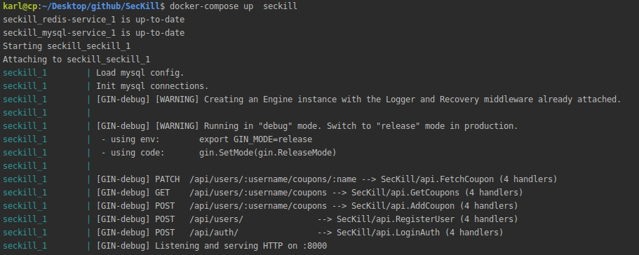
    
    或者测试一下能不能把mysql和redis单独运行起来
    
    docker-compose up -d mysql-service
    
    docker-compose up -d redis-service
    
5. 都成功后运行 docker ps 可以查看到三个服务容器的运行状态
    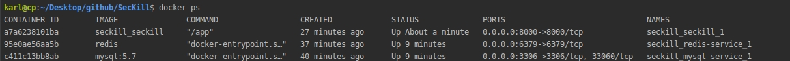

# 登录mysql查看用户和优惠券数据
（后来把mysql用户和密码都改为了root root，数据库seckill，所以截图显示的不是最新的情况）
1. mysql -uroot -proot -h 127.0.0.1

2. show databases; use seckill; show tables;

   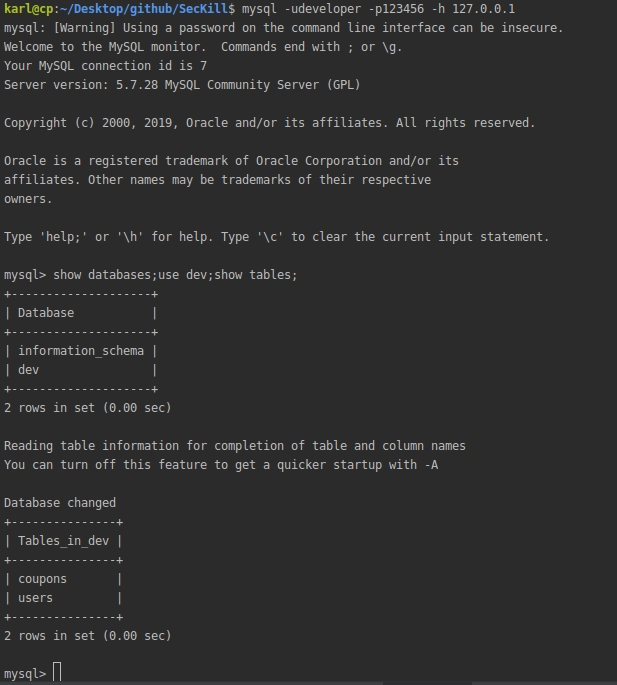
# 登录redis查看session等数据
1. redis-cli -h 127.0.0.1 -p 6379 -a 123456
  
   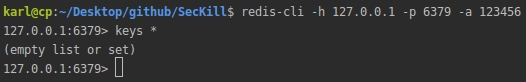
   
# 接口测试
## 添加优惠券
具体样例描述 [add_coupon_cases.go](./httptest/add_coupon_cases.go)

如，用户添加优惠券的权限，重复添加，优惠券格式等

中间的一系列 printer(太多了所以截图跳过了中间输出) 输出的是一些模拟请求信息，直接看最后的 **PASS** 即可代表通过所有样例

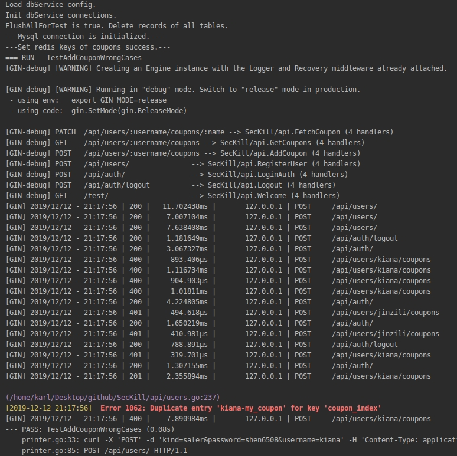

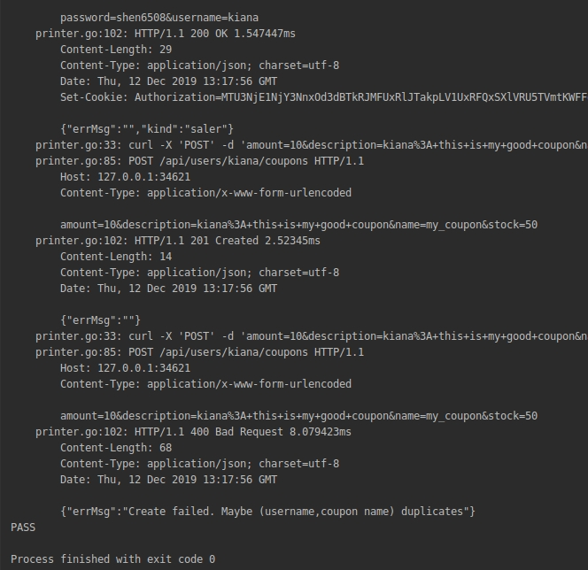
## 注册登录
具体样例描述 [register_test.go](./httptest/register_test.go)

如，用户登录注册的格式问题，和重复注册等问题

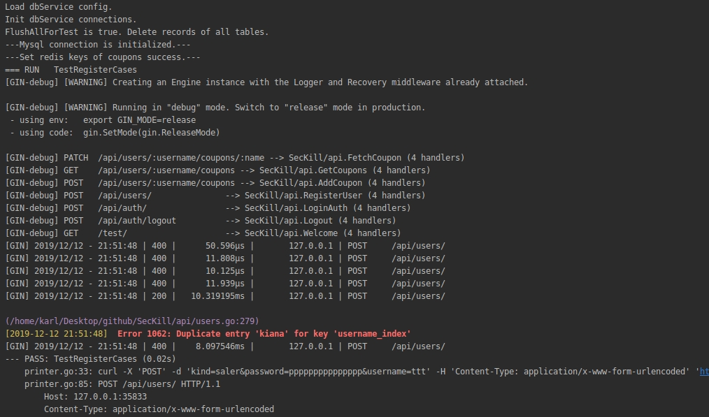

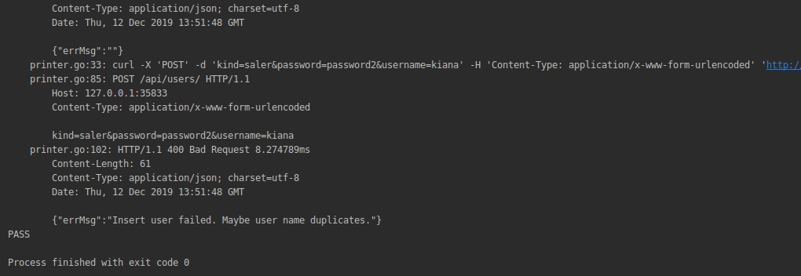

## 一些常见组合样例
如，用户注册登录后，商家添加查看优惠券，用户查看优惠券，以及用户抢购优惠券成功失败的情况，具体样例描述 [normal_test.go](./httptest/normal_test.go)

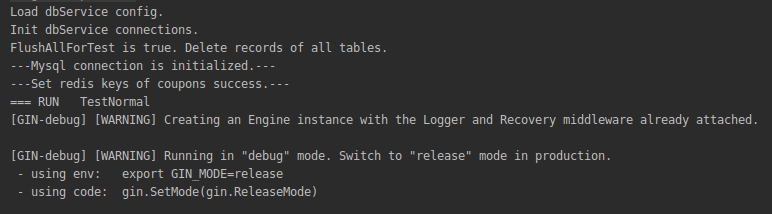

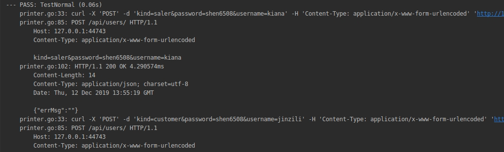

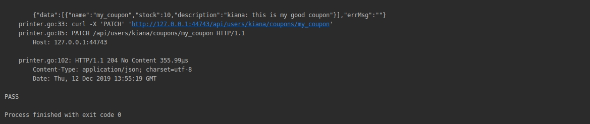

# 并发测试
暂时莫得……